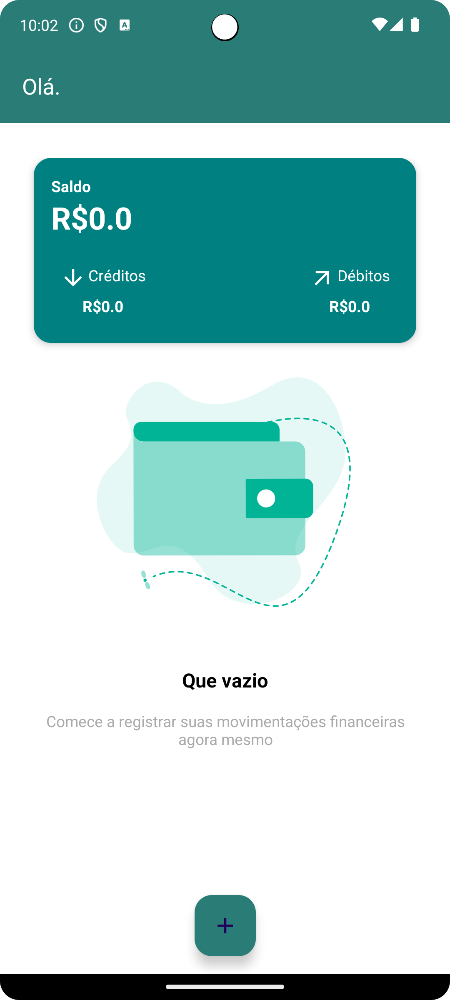
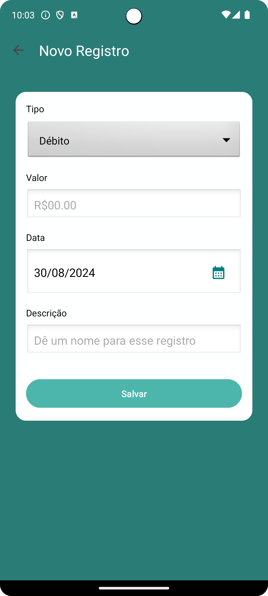
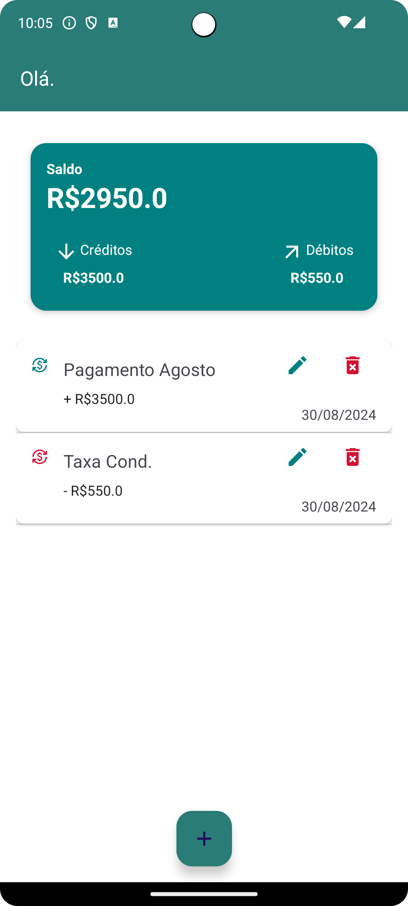

# Monefy

## Visão Geral

Este projeto é o trabalho de conclusão da disciplina de **ANDROID APLICADO** do Curso de Especialização em Programação para Dispositivos Móveis.

## Funcionalidades

- **Funcionalidade 1**: Registro de Despesas e Receitas
- **Funcionalidade 2**: Visualização de Saldo/Débitos/Créditos

## Capturas de Tela





## Instalação

### Pré-requisitos

Antes de buildar e executar o app, certifique-se de que possui os seguintes softwares instalados:

- [Android Studio](https://developer.android.com/studio)
- [Java Development Kit (JDK)](https://www.oracle.com/java/technologies/javase-jdk11-downloads.html) (versão 11 ou superior)
- Android SDK atualizado

### Clonando o Repositório

Clone o repositório usando Git:

```bash
git clone git@github.com:DouglasValerio/monefy-android.git
cd monefy-android
```

### Importando o Projeto no Android Studio
1. Abra o Android Studio.
2. Selecione "Open an existing Android Studio project".
3. Navegue até o diretório do projeto e selecione-o.
4. O Android Studio irá sincronizar o projeto e baixar as dependências necessárias.

#### Executando o App
1. Conecte seu dispositivo Android ou inicie um emulador.
2. Clique no botão "Run" no Android Studio, ou use o atalho Shift + F10.
3. O app será buildado e instalado no dispositivo conectado ou no emulador.
